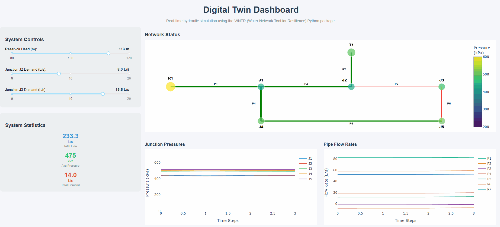
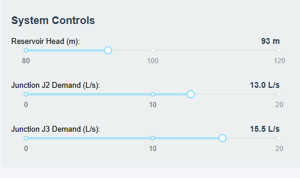
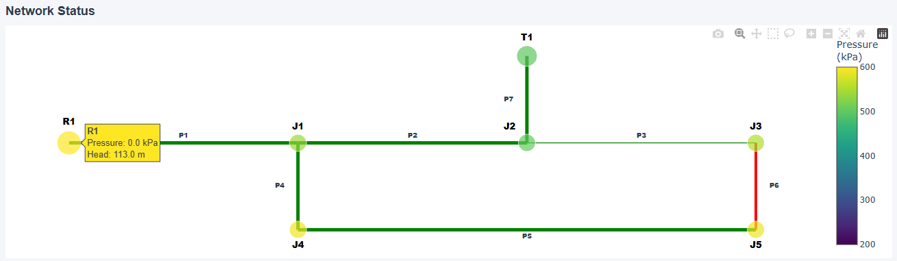
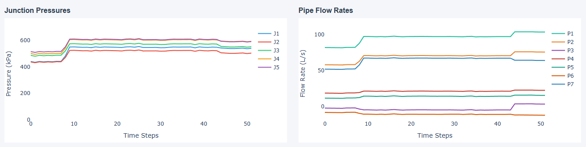

# dt-water-project
Digital twin of water distribution system using Python and WNTR

A real-time hydraulic simulation dashboard for a water distribution network, made in Python utilising the WNTR (Water Network Tool for Resilience) package. This project demonstrates digital twin concepts that apply to real-world systems and are particularly useful for predictive maintenance and real-time monitoring across energy, aerospace, nuclear and utilities sectors.

This digital twin simulates a 7-node water distribution network with the ability to monitor the flow rates in the pipes and pressures at nodes in real-time. Users can interactively adjust system parameters and observe the responses throughout the network.

# Installation:
1. Clone the repo
   
   git clone https://github.com/kieranfarrar04/dt-water-project.git  
   cd water-distribution-digital-twin

2. Create Virtual Environment
   
   python -m venv venv
   
   Windows:
   
   venv\Scripts\activate
   
   macOS/Linux:
   
   source venv/bin/activate
   
4. Install Dependencies
   
   pip install -r requirements.txt

5. Run the application
   python water_twin_dashboard.py

# Dashboard Features
Adjust key parameters in real time:
- Reservoir Head (80-120m)
- Junction J2 Demand (0-20L/s)
- Junction J3 Demand (0-20L/s)

An interactive network diagram that shows:

- Node pressures
- Pipe flow rates
- Flow direction
- Hoverable details for all components
  

Real Time Monitoring

- Junction Pressures
- Pipe flow rates
- System Statistics

